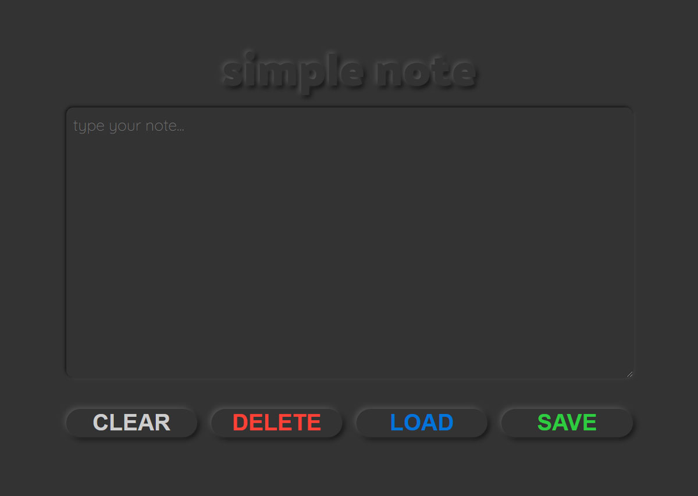

# simple note

Prosty notatnik z opcją zapisu treści notatki do local storage.

## po co i dlaczego?

Projekt powstał w ramach szkolenia [WTF - co ten frontend](https://cotenfrontend.pl).

Głównym celem projektu było zapoznanie się z możliwościami przechowywania danych w przeglądarce.

## jak działa?

Pozwala na zapisanie notatki do local storage, wczytanie zapisanej wcześniej notatki oraz usunięcie notatki z local storage.

## jak zostało zrobione?

### Technologie wykorzystane w projekcie:

- html
- css (scss)
- js

## wypróbuj!

> https://marta-kapolka.github.io/simple-note/
