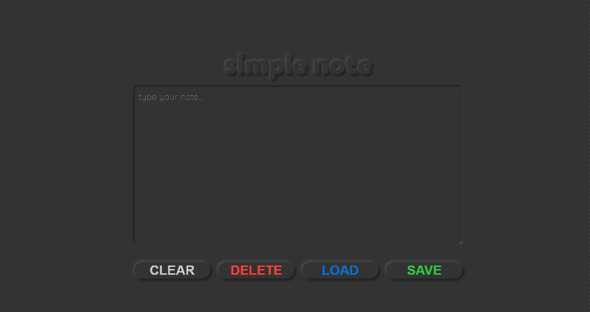

# simple note

---

Minimalistic notepad using local storage to save and load your note.

LIVE: [simple note](https://marta-kapolka.github.io/simple-note/)

## Technologies used

- HTML5
- CSS3 (SCSS)
- JavaScript

## More about the project

### Goal

The main goal of the project was to understand how **local and session storage** works. I also used it to practice my CSS skills creating neumorphic UI design.

### Main objectives

- use **local storage** to save and get data
- create **responsive** layout

### Features

App lets you save your note in browsers local storage and get it back later. If there is a note saved in storage there is a notification on a load button. You can also delete a note from storage and clear the textbox using a button.

## Credits

Project was build as an exercise during [WTF - co ten frontend](https://cotenfrontend.pl) course.
